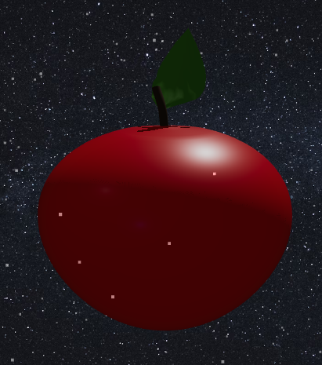

<h1>🍎 苹果实验室 

 Apple Laboratory PRO</h1>

一个基于 WebGL 的沉浸式 3D 互动体验项目。

解构、切片、基因修改，或是进入“禅意模式”放空心灵。

<!-- 徽章区域 -->

<!-- 演示按钮 -->

<h3>
<a href="https://www.google.com/search?q=https://%E4%BD%A0%E7%9A%84%E7%94%A8%E6%88%B7%E5%90%8D.github.io/%E4%BD%A0%E7%9A%84%E4%BB%93%E5%BA%93%E5%90%8D/">🚀 点击进入实验室 (Live Demo)</a>
</h3>

✨ 核心特性 (Features)

<table>
<tr>
<td width="50%">
<h3>🧪 基因修改</h3>
<ul>
<li>自由调整苹果高度、胖瘦。</li>
<li>实时颜色调配，支持 HEX 选色。</li>
<li><b>彩虹流光模式</b>：赛博朋克风格的视觉体验。</li>
</ul>
</td>
<td width="50%">
<h3>🔪 动态切片</h3>
<ul>
<li>独创 <b>Chip Slicing</b> 算法。</li>
<li>手风琴式拉伸交互。</li>
<li>果肉与果皮双材质渲染。</li>
</ul>
</td>
</tr>
<tr>
<td width="50%">
<h3>🧘 禅意发呆 (Zen Mode)</h3>
<ul>
<li>沉浸式计时器，屏蔽一切干扰。</li>
<li><b>本地排行榜</b>：记录你的每一次专注。</li>
<li>自定义命名每一次“放空时刻”。</li>
</ul>
</td>
<td width="50%">
<h3>🎨 极致视觉</h3>
<ul>
<li><b>全息投影 (Hologram)</b> 模式。</li>
<li>粒子光环与呼吸律动特效。</li>
<li>支持导出高清无背景 SVG/PNG。</li>
</ul>
</td>
</tr>
</table>

🛠️ 技术栈 (Tech Stack)

本项目使用纯原生技术构建，无需复杂的构建工具，开箱即用。

核心 3D 引擎

UI 界面设计

结构与逻辑

🚀 快速开始 (Quick Start)

这是一个纯静态项目，您可以直接下载并在本地运行，或者部署到任何静态托管服务。

# 克隆项目
git clone [https://github.com/Jimmyverysix/apple-lab.git](https://github.com/Jimmyverysix/apple-lab.git)

# 进入目录
cd 你的仓库名

# 双击 index.html 即可运行

📈 Star 趋势 (Star History)

🤝 贡献 (Contributing)

欢迎提交 Issue 或 Pull Request！如果你喜欢这个项目，请给它一个 ⭐️ Star！

📄 许可证 (License)

本项目基于 MIT License 开源。

Made with ❤️ by <a href="https://www.google.com/search?q=https://github.com/%E4%BD%A0%E7%9A%84%E7%94%A8%E6%88%B7%E5%90%8D">JIMMYVERYSIX</a>

